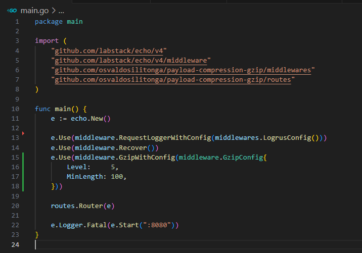
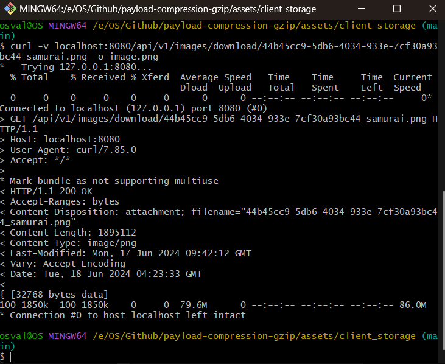
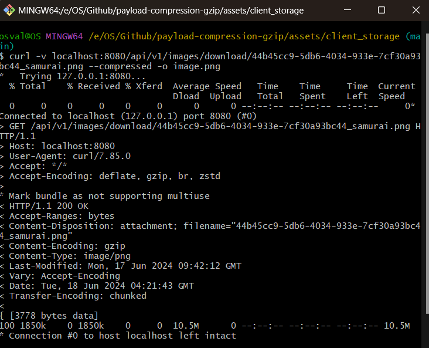
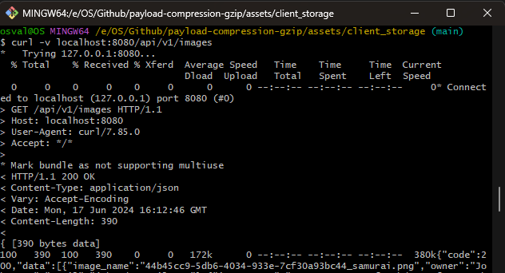
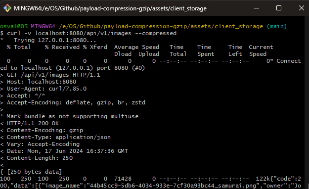

# Payload Compression - GZip
HTTP Compression adalah teknik kompresi data pada HTTP response, yeng bertujuan agar ukuran/size output menjadi lebih kecil dan response time lebih cepat.

## Background
Ini adalah simulasi penerapan Payload Compression. Pada aplikasi ini disedian 3 endpoint yaitu: `GET: api/v1/images/download/{id}`, `POST: api/v1/images/upload`, `GET: api/v1/images`. Endpoint tersebut berfungsi untuk melakukan download file, upload file, dan mengambil semua data dalam bentuk JSON. Aplikasi ini ditulis dengan bahasa <b>Golang</b> dengan menggunakan framework <b>Echo</b>.

Tujuan dari pembuatan aplikasi ini untuk melihat perbedaan antara response yang menerapkan kompresi dan response yang tidak menerapkan kompresi.

## Penerapan
Pada framework Echo sudah disediakan middleware untuk melakukan Payload Compression menggunakan GZip. Untuk lebih lengkapnya bisa mengunjungi halaman dokumentasi berikut: https://echo.labstack.com/docs/middleware/gzip

```go
e := echo.New()

e.Use(middleware.GzipWithConfig(middleware.GzipConfig{
    Level:     5,
    MinLength: 1000,
}))
```



Pada code diatas di terapkan Payload Compression menggunakan Gzip pada middleware dengan configurasi sebagai berikut:

1. Level : Compression level, di isi dengan angka 1-9. Semakin tinggi level kompresinya maka akan semakin kecil ukuran datanya. Namun akan memakan waktu lebih lama saat melakukan compressi maupun decompressi.
2. MinLength : Minimal ukuran data yang akan dilakukan kompresi dalam satuan byte. Dalam kasus ini ukuran minimal untuk dilakukan kompresi adalah 1000 byte. Apabila ukuran data lebih kecil dari 1000 byte maka tidak akan dilakukan kompresi, sebaliknya jika ukuran data 1000 byte atau lebih maka akan dilakukan kompresi.

## Testing
Untuk melihat perbedaan antara response dengan kompresi dan response tanpa kompresi, dilakukan percobaan request ke endpoint menggunakan CURL.

1. Test Pertama - Download File

<figure style="text-align: center;">
  
  <figcaption>1.1 Without Compression</figcaption>
</figure>

<figure style="text-align: center;">
  
  <figcaption>1.2 With Gzip Compression</figcaption>
</figure>

Pada 2 gambar di atas dapat dilihat perbedaan, dimana gambar 1.1. mengirim sebesar ukuran file aslinya yaitu <b>[32768 bytes data]</b>, sementara pada gambar 1.2 dengan request yang sama namun melakukan kompresi terlebih dahulu, data yang di kirim berukuran <b>[3778 bytes data]</b> dan menggunakan <b>Transfer-Encoding</b>: chunk, yang berarti data dikirim dalam potongan-potongan kecil.

2. Test Kedua - JSON

<figure style="text-align: center;">
  
  <figcaption>2.1 Without Compression</figcaption>
</figure>

<figure style="text-align: center;">
  
  <figcaption>2.2 With Compression</figcaption>
</figure>

Perbedaan dapat dilihat dari ukuran data yang dikirim. Pada gambar 2.1 tanpa menerapkan kompresi ukuran data yang dikirim <b>[390 bytes data]</b>, sementara pada gambar 2.2 yang melakukan kompresi ukuran data yang dikirim <b>[250 bytes data]</b>

## Conclusion
Manfaat dari menerapkan Payload Compression adalah dapat meningkatkan kecepatan pengiriman data, menghemat penggunaan bandwith dikarenakan ukuran response data yang diperkecil dan efisiensi jaringan. 

Namun perlu dipertimbangkan juga dikarenakan adanya proses kompresi dan dekompresi data maka akan memerlukan resource CPU di sisi server dan klien. Pada server dengan beban tinggi atau klien dengan perankat keras yang lemah, ini bisa menjadi masalah. Mengkompresi respons yang sangat kecil juga dapat menambah overhead tanpa memberikan manfaat yang signifikan karena ukuran kompresi tidak jauh berbeda dari ukuran aslinya. Proses kompresi dan dekompresi juga dapat menambah sedikit latency pada waktu response karena memerlukan waktu tambahan untuk melakukan proses tersebut.

Penting untuk menyesuaikan konfigurasi berdasarkan kebutuhan spesifik aplikasi dan melakukan pengujian untuk menemukan keseimbangan yang optimal antara penghematan bandwidth dan kinerja server serta klien.